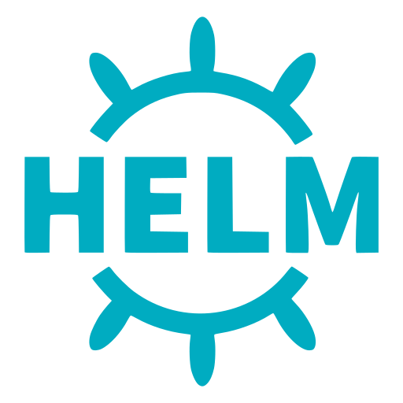
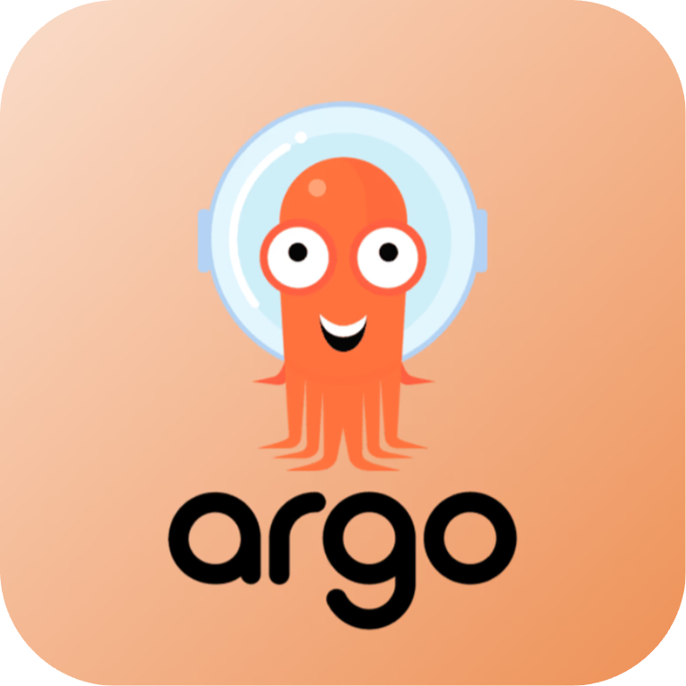
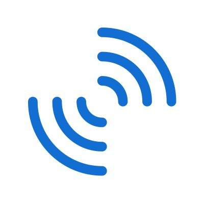
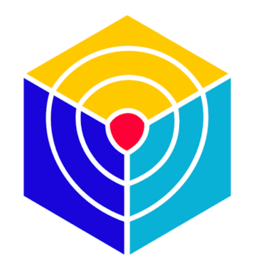

DevOps and Platform Engineer building reliable cloud-native platforms, Infrastructure as Code, GitOps delivery, and production observability.

My work spans Kubernetes, multi-cloud infrastructure, CI/CD automation, DevSecOps, reliability, and developer enablement across **Onecom, Deloitte, and Accenture**.

I contribute to CNCF ecosystem projects including **Backstage** and **OpenTelemetry**. I am also interested in applying my platform engineering, observability, and distributed-computing experience to **AIOps and MLOps**.

## Production Impact

## Cloud-Native Stack

### Cloud and Infrastructure

### Containers and Platform Engineering

 

### CI/CD, GitOps and Collaboration

  

### Observability, Logging and Security

   

### Programming, APIs and Data

## Projects

<table>
<thead>
<tr>
<th width="50%" align="left">Infrastructure Automation</th>
<th width="50%" align="left">Cloud Cost Optimization</th>
</tr>
</thead>
<tbody>
<tr>
<td width="50%" valign="top">

  

<strong>Terraform Drift Detection</strong>

  Reusable GitHub Actions workflow that detects infrastructure drift across multiple Terraform root modules without modifying infrastructure.

  <code>Terraform</code>
  <code>GitHub Actions</code>
  <code>GCP</code>
  <code>OIDC</code>
  <code>Workload Identity Federation</code>
  <code>Microsoft Teams</code>

  

</td>
<td width="50%" valign="top">

  

<strong>GCP Cloud Cost Optimizer</strong>

  AI-assisted FinOps platform that identifies inefficient cloud resources and produces rightsizing, savings, and remediation guidance.

  <code>GCP</code>
  <code>Python</code>
  <code>FastAPI</code>
  <code>Gemma</code>
  <code>PostgreSQL</code>
  <code>React</code>
  <code>WebSockets</code>
  <code>JWT</code>

  

</td>
</tr>
</tbody>
</table>

<table>
<thead>
<tr>
<th width="50%" align="left">Developer Platform</th>
<th width="50%" align="left">Kubernetes Infrastructure</th>
</tr>
</thead>
<tbody>
<tr>
<td width="50%" valign="top">

  

<strong>Secure SonarQube Platform on GKE</strong>

  Self-hosted code-quality platform with Kubernetes-native secret management and controlled enterprise access.

  <code>GCP</code>
  <code>GKE</code>
  <code>Kubernetes</code>
  <code>Helm</code>
  <code>SonarQube</code>
  <code>External Secrets Operator</code>
  <code>Gateway API</code>
  <code>Cloud Armor</code>

  

</td>
<td width="50%" valign="top">

  

<strong>Kubernetes on AWS</strong>

  Terraform-provisioned AWS infrastructure with Route 53, S3-backed KOPS state, and multi-zone Kubernetes deployment.

  <code>AWS</code>
  <code>Kubernetes</code>
  <code>KOPS</code>
  <code>Terraform</code>
  <code>EC2</code>
  <code>Route 53</code>
  <code>S3</code>
  <code>Linux</code>

  

</td>
</tr>
</tbody>
</table>

<strong>More Cloud, DevOps, and Platform Projects</strong>

### AI-Assisted Vulnerability Management

Automated CVE impact assessment and Jira ticket creation across more than 200 dependencies, reducing manual security triage by 60%.

`GitHub Actions` `Gemma` `Jira` `Python` `DevSecOps` `CVE Automation`

---

### AWS Cloud-Native Microservices

Highly available microservices architecture using automatic scaling, load balancing, caching, messaging, managed databases, and global content delivery.

`AWS` `EC2` `ELB` `Auto Scaling` `RDS` `MySQL` `ElastiCache` `Redis` `Amazon MQ` `CloudFront` `Route 53` `CloudWatch`

---

### AWS Delivery Pipeline

Build and deployment automation for a multi-service Java application and its supporting AWS services.

`AWS CodePipeline` `CodeBuild` `Jenkins` `Maven` `SonarQube` `Ansible` `Java` `S3` `RDS`

---

### Ansible Infrastructure Automation

AWS hosts provisioned with Terraform and configured through an Ansible controller and reusable managed-node playbooks.

`AWS` `EC2` `Terraform` `Ansible` `Linux` `YAML` `SSH` `Configuration Management`

---

### Azure Serverless File Platform

Event-driven file-sharing platform supporting large uploads with controlled, time-limited access and automated delivery.

`Azure Functions` `Blob Storage` `Logic Apps` `SAS` `GitHub Actions` `Serverless` `Event-Driven Architecture`

---

### Ray Distributed Computing Infrastructure

Supported distributed-computing infrastructure for large-scale Python and AI workloads.

`Ray` `Python` `Docker` `Kubernetes` `AWS` `Distributed Computing` `AI Infrastructure`

---

### Kubernetes Monitoring and Observability

Designed Kubernetes monitoring for CPU, memory, pod restarts, disk utilization, application latency, and platform health.

`Kubernetes` `Prometheus` `Grafana` `PromQL` `Alerting` `SLOs` `Observability`

---

### Multi-Cloud CI/CD Platform

Designed and optimized delivery pipelines across cloud environments, reducing deployment time by 44% and compute costs by 37%.

`Azure DevOps` `Jenkins` `GitHub Actions` `Azure` `Terraform` `PowerShell` `SonarQube` `Trivy`

---

### Containerized Java Application Platform

Containerized Java applications using multistage builds and automated Linux configuration.

`Docker` `Java` `Multistage Builds` `Linux` `Ansible` `Jenkins` `Maven`

## Professional Certifications

## Let's Connect

I am interested in conversations about **Platform Engineering, DevOps, Cloud Infrastructure, SRE, open source, AIOps, and MLOps**.

